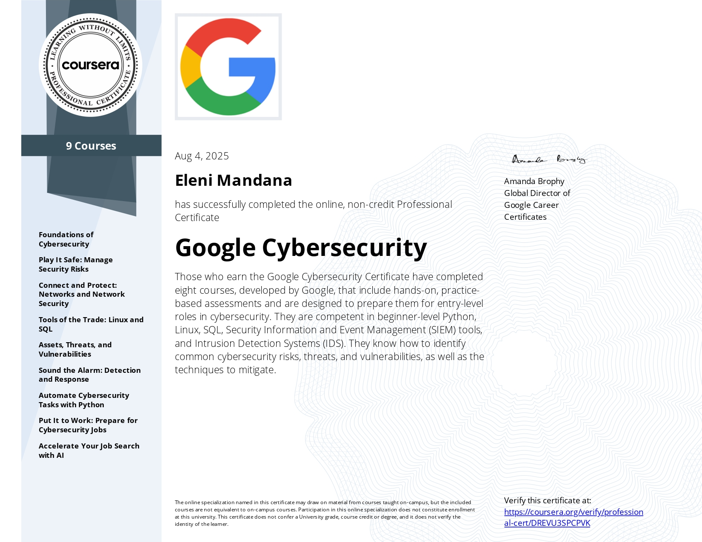

# Google Cybersecurity Professional Certificate Projects 

**Completed:** 08/2025  

## Overview
This repository contains my completed projects from the Google Cybersecurity Professional Certificate.  
Each project applies real-world cybersecurity skills, including threat analysis, SQL investigations, network traffic analysis, and incident response.

The [Google Cybersecurity Professional Certificate](https://www.coursera.org/professional-certificates/google-cybersecurity) covers foundational to intermediate skills in security tools, threat detection, analysis, incident response, and governance. 

## Core Skills
- Threat detection and analysis
- SQL for investigation and data retrieval
- Network traffic analysis (Wireshark, tcpdump)
- Incident response reporting
- Security policies and procedures

## 📁 Projects
### [1. Security Audit](reports/2.%20Controls%20and%20compliance%20checklist.pdf) 

Evaluated security controls and compliance posture for an e-commerce company using PCI DSS, GDPR, and SOC requirements. Identified critical gaps in access controls, encryption, and backup procedures. Provided risk-prioritized remediation recommendations.

**Skills**: Security controls assessment, compliance mapping, risk analysis, gap identification

### [2. Incident Response Analysis](reports/3.%20Incident%20report%20analysis.pdf)
Analyzed a DDoS attack scenario using the NIST Cybersecurity Framework (Identify, Protect, Detect, Respond, Recover). Investigated root cause (misconfigured firewall), documented containment actions, and recommended prevention measures, including IDS/IPS implementation and monitoring improvements.

**Skills**: Incident analysis, NIST framework application, root cause analysis, network security fundamentals

### [3. SQL Security Investigation](reports/4.%20Apply%20filters%20to%20SQL%20queries.pdf)
Used SQL queries to investigate security incidents and support administrative tasks. Applied filtering techniques to analyze failed login attempts after work hours, investigate suspicious activity on specific dates, and identify login attempts from outside Mexico. Also queried employee databases for security updates across departments.

**Skills**: SQL filtering, security log analysis, data investigation, database querying

### [4. Vulnerability Assessment Report](reports/5.%20Vulnerability%20assessment%20report.pdf)
Conducted a qualitative risk assessment of a publicly accessible MySQL database server using *NIST SP 800-30 Rev. 1* methodology. Identified and scored threats from hackers, hacktivists, and competitors using likelihood × severity calculations. Recommended layered security controls including least privilege access, MFA, AAA framework, and IDS/IPS implementation.

**Skills**: Vulnerability assessment, NIST risk methodology, threat modeling, qualitative risk analysis, security remediation planning

### [5. Incident Handler's Journal](reports/6.%20Incident%20handlers%20journal.pdf)
Documented three security incidents and hands-on lab exercises in a professional incident journal format. Investigated malware incident using VirusTotal (5 W's methodology), performed network packet analysis with tcpdump, and configured custom IDS rules with Suricata. Included reflections on incident response methodology and tool effectiveness.

**Skills**: Incident documentation, malware analysis, network packet capture, IDS rule configuration, 5 W's investigation framework

### [6. Python Security Automation Algorithm](reports/7.%20Algorithm%20for%20file%20updates%20in%20Python.pdf)
Developed a Python algorithm to automate IP address access control management for healthcare data containing patient records. The script reads an allow list file, removes unauthorized IP addresses from a remove list, and updates the file with cleaned data. Demonstrated file I/O operations, string manipulation, list processing, and conditional logic for security automation.

**Skills**: Python, security automation, file manipulation, access control management

## Certification

